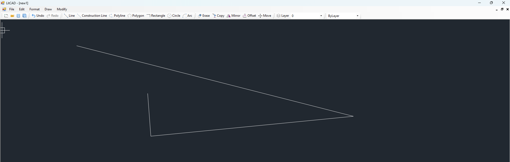

# LitCAD
LitCAD is a very simple 2D CAD drawing application developed in C#.

LitCAD is free software; you can redistribute it and/or modify it under the terms of the [MIT License](https://opensource.org/licenses/MIT).

#### Building

Download the source code and open `./src/LitCAD.sln` with Visual Studio 2010, then you can directly compile and build this project.

#### Main Features

* Supports entities: line, xline, ray, polyline, circle, arc, text.

* Zoom and pan.

* Layer support.

* Grip points for modifying entities by moving them.

* Snap (currently supports endpoint, midpoint, center, quadrant).

* Basic editing tools: delete, copy, mirror, offset, move.

* Undo and redo.

* Multiple ways for object selection: Pick Single, Window, Cross.

* Open and save `.litcad` files.

#### Entities Supported

* line
* xline
* ray
* polyline
* circle
* arc
* text

# LICENSE

This project is licensed under the [MIT License](LICENSE).
